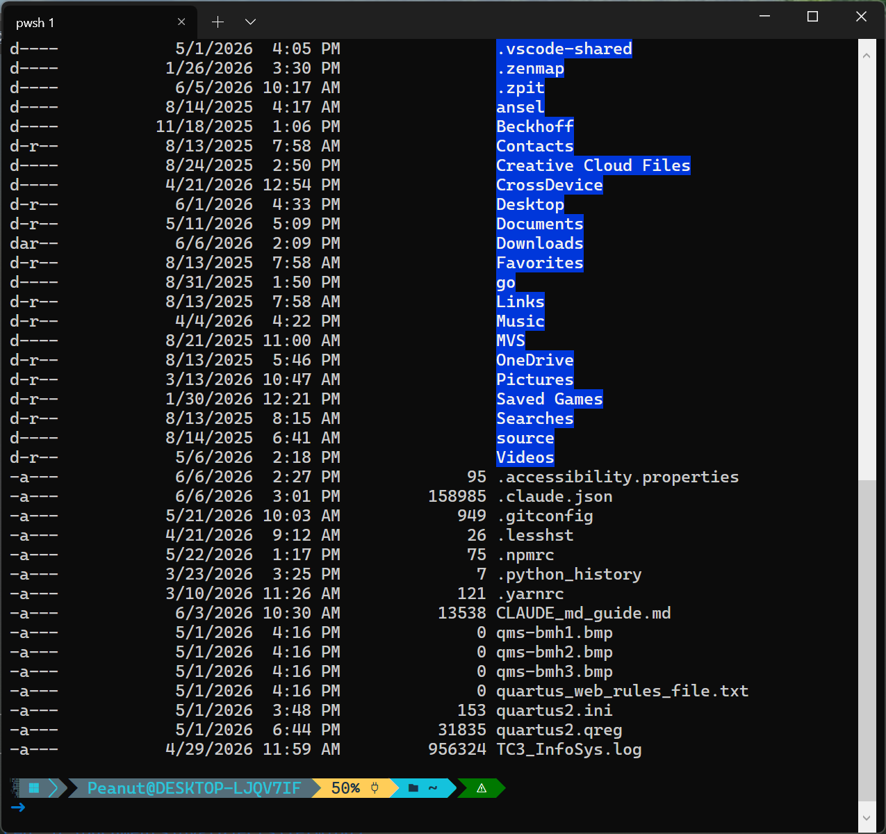

<p align="center">
  
</p>

# Term1809

A WPF terminal emulator for Windows, built on the [Official Windows Terminal](https://github.com/microsoft/terminal) ConPTY backend and GPU-accelerated rendering engine. The terminal-integration code in this repository is an independent implementation written against the public ConPTY Win32 API and the Windows Terminal WPF rendering control — see LICENSE and THIRD-PARTY-NOTICES.md. Targets **Windows 10 Enterprise LTSC 2019 (build 17763)** compatibility.

> **A terminal for Windows 10 version 1809 / LTSC 2019.** Microsoft's official [Windows Terminal](https://github.com/microsoft/terminal) requires Windows 10 1903 (build 18362) or later, so it **cannot be installed on Windows 10 1809 (build 17763)** or Windows 10 Enterprise/IoT LTSC 2019. Term1809 brings a modern, GPU-accelerated terminal — ANSI/VT, 24-bit color, tabs, mouse support — to those older builds. If you searched for *"terminal for Windows 1809"*, *"Windows Terminal for LTSC 2019"*, or *"Windows Terminal on build 17763"*, this is what you were looking for.

<p align="center">
  
</p>

## Features

- Full terminal emulation: ANSI/VT escape sequences, 24-bit color, mouse support, GPU-accelerated rendering
- Windows-Terminal-style custom title bar with in-titlebar tabs (multi-terminal, via [HandyControl](https://github.com/HandyOrg/HandyControl))
- Tab / Shift+Tab passthrough to the terminal app (works on build 17763 — see `docs/tab-key-passthrough.md`)
- Ctrl+C copies selected text (falls back to interrupt), Ctrl+V pastes
- CJK IME composition window positioned at the terminal cursor
- File drag-and-drop pastes quoted paths into the terminal
- Detachable PTY: a live terminal session can be disconnected from one control and reattached to another, even across windows

## Requirements

- Windows 10 build 17763 (LTSC 2019) or later, x64
- No .NET runtime needed on target machines — command-line builds are self-contained

## Build & Run

Requires the .NET 10 SDK.

```powershell
dotnet build Term1809.sln -c Debug
dotnet run --project Term1809 -c Debug
```

## Project Structure

```
Term1809/
├── MainWindow.xaml(.cs)      # Tabbed multi-terminal UI, custom title bar
├── TerminalTabViewModel.cs   # Per-tab state
├── ProcessOutput.xaml(.cs)   # Delimited-output capture sample window
├── NativeMethods.txt         # CsWin32 P/Invoke source generator input
└── Terminal/                 # The terminal control (Term1809.Terminal namespace)
    ├── PtyTerminalControl.cs     # UserControl: XAML API, theming, native input hooks
    ├── ConPtyConnection.cs       # ConPTY I/O, process lifecycle, interceptors
    ├── DelimitedConPtyConnection.cs  # Buffers output until a delimiter is seen
    └── Internals/                # ConPtyHandle, ChildProcessLauncher, pipes, P/Invoke
```

## Using the Terminal Control

```xml
xmlns:term="clr-namespace:Term1809.Terminal"
...
<term:PtyTerminalControl StartupCommandLine="pwsh.exe" />
```

### Key properties (XAML bindable)

Some properties are write-only: the terminal state can be changed externally (e.g. by VT codes the running app emits), so reading them back would be unreliable — setting them always applies.

- **StartupCommandLine** *(string, "powershell.exe")* — full command line to launch, arguments included
- **StartupWorkingDirectory** *(string, user profile dir)* — working directory for the terminal process; `null` inherits the host app's
- **Theme** *(TerminalTheme?, write-only)* — colors, cursor style, etc.
- **IsReadOnly** *(bool?, write-only)* — ignore all input from the terminal UI
- **IsCursorVisible** *(bool?, write-only)* — apps emitting VT codes can re-enable it
- **Win32InputMode** *(bool, true)* — use Windows Terminal's [win32-input-mode](https://github.com/microsoft/terminal/blob/main/doc/specs/%234999%20-%20Improved%20keyboard%20handling%20in%20Conpty.md) so key data survives the VT translation
- **NavigationCapture** *(NavigationCapture flags)* — which navigation keys (Tab, arrows) the control keeps from WPF focus navigation
- **LogOutput** *(bool, false)* — passively log the session; retrieve with `Connection.GetBufferText()`
- **FontFamilyWhenSettingTheme** / **FontSizeWhenSettingTheme** — applied when `Theme` is set
- **Connection** *(ConPtyConnection)* — the backend connection; swap it to migrate a session between controls

### Key methods

- `PtyTerminalControl.DetachConnection()` / `RestartConnection(useTerm, disposeOld)` — detach or restart the backend session
- `ConPtyConnection.SendInput(...)` — inject input to the running app as if typed
- `ConPtyConnection.EmitOutput(...)` — simulate output on the terminal UI (e.g. render saved ANSI logs)
- `ConPtyConnection.OutputInterceptor` / `InputInterceptor` — delegates to inspect or rewrite data in transit
- `DelimitedConPtyConnection.SetOutputDelimiter(...)` — only release output when a delimiter is seen (discrete command capture)

## Limitations

The terminal renders in its own native HWND (that is how Windows Terminal achieves its performance), so WPF content cannot be drawn on top of the terminal area — the same airspace limitation as WebView2. Context menus and separate windows work fine.

## FAQ

**Can I run Windows Terminal on Windows 10 1809 / LTSC 2019?**
No — Microsoft's official Windows Terminal requires Windows 10 1903 (build 18362) or newer, so it will not install on Windows 10 version 1809 (build 17763) or Windows 10 Enterprise/IoT LTSC 2019. Term1809 is built specifically to give those builds a modern terminal experience.

**Is this the official Microsoft Windows Terminal?**
No. Term1809 is an independent project. It reuses the open-source ConPTY backend and the WPF rendering control from [microsoft/terminal](https://github.com/microsoft/terminal) (MIT licensed), but it is not affiliated with or endorsed by Microsoft.

**What Windows versions are supported?**
Windows 10 build 17763 (version 1809 / LTSC 2019) and later, x64.

## Credits

- [microsoft/terminal](https://github.com/microsoft/terminal) (MIT) — ConPTY and the GPU-accelerated rendering engine that powers this project
